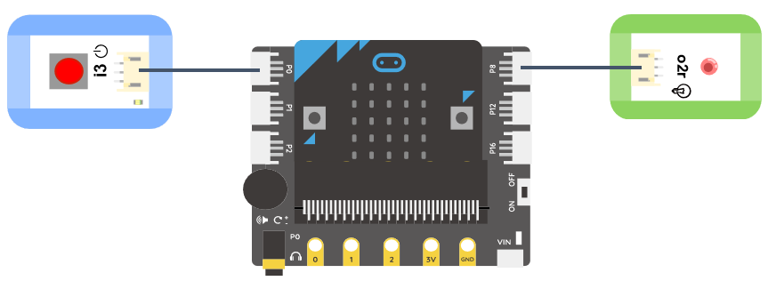

# 自鎖開關 (Self Locking Switch)

## 實體照片

## 基本信息

中文名称：自锁开关

英文名称：Self Locking Switch

序号：i3

SKU：BOS0003

## 功能简介

自锁开关，是一种常见的按钮开关，它和按钮模块不同的地方在于它可以把开关锁定在一种状态下，当它的按键被按下以后可以保持，直到第二次被按以后弹起。这种巧妙的技术广泛应用于我们的家用电器中，比如电饭煲、电热水壶等。

## 使用说明

自锁开关能够识别按键动作并输出数字信号。其机制如下：

> * 第一次按键，按键按下，开关接通并保持，模块持续输出高电平，即“开”或“1”；
> * 第二次按键，按键弹起，开关断开，模块输出低电平，即“关”或“0”。

以自锁开关控制LED灯为例，第一次按下按键，持续输出高电平，小灯常亮；第二次按下按键，按键被弹起，输出低电平，小灯熄灭。

## 原理介绍

无

## 应用样例

### \(1\) 点亮LED灯（非编程）

**样例说明：**通过自锁开关控制LED的亮灭。第一次按下自锁开关，LED灯被点亮，第二次按下自锁开关，LED灯被熄灭。

**元件清单：**自锁开关；LED模块；电源主板-单路。

**连线图：**

### \(2\) 点亮LED灯（编程）

**样例说明：**通过自锁开关控制LED的亮灭。第一次按下自锁开关，LED灯被点亮，第二次按下自锁开关，LED灯被熄灭。

**元件清单：**自锁开关；LED模块；Micro:bit；Micro:bit BOSON扩展板。

**连线图：**将自锁开关连接至Micro:bit扩展板引脚P0，LED模块连接至Micro:bit扩展板引脚P8。

**执行流程：**① 如果引脚P0输出高电平（“1”），即自锁开关被按下，则LED模块亮起；② 如果引脚P0输出低电平（“0”），即自锁开关被松开，则LED模块熄灭。

**程序示意图（中文版）：**

**程序示意图（英文版）：**

### \(3\) 开启风扇

**样例说明：**通过自锁开关控制风扇的开启与关闭。第一次按下自锁开关，风扇开始转动，第二次按下自锁开关，风扇停止转动。

**元件清单：**自锁开关；风扇模块；电源主板-单路。

**连线图：**

### \(4\) 爬爬虫

**样例说明：**通过自锁开关和舵机控制模块控制舵机像虫子一样向前爬动。

**元件清单：**自锁开关；舵机控制模块；9g金属舵机模块；电源主板-单路。

**连线图：**

## 参数规格

引脚说明：

重量： （g）

尺寸：26mm\*22mm

工作电压：3.0-5.5V

工作电流：不大于5mA@5V

