# 心率传感器

## 实物图片

## 基本信息
中文名称：心率传感器

英文名称：Heart Rate Monitor Sensor

序号：i20

SKU：BOS0043

## 功能简介
心率传感器采用光学技术通过皮下毛细血管内的血氧量变化来检测人体的心率，心率检测可广泛应用于可穿戴设备、健身辅助器材等场景。

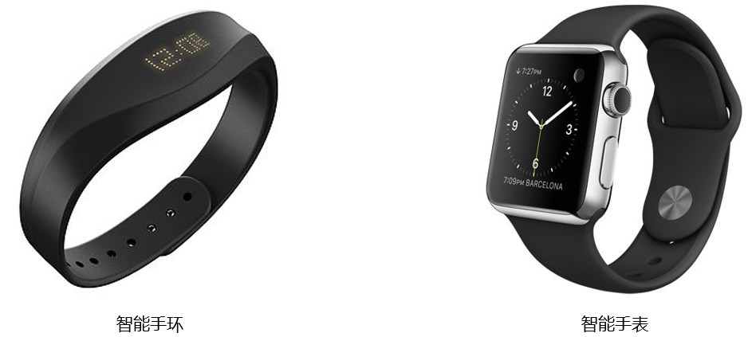

## 使用说明
心率传感器在使用时需要测量者将任一手指放于下图所示位置①处进行测量，心率传感器的输出信号是数字信号，即高低电平。

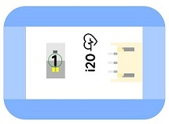

按照下图所示连接电路，通电后将手指放在心率传感器指定位置处即可通过显示屏模块查看测量者的心率。

**心率传感器在使用时需注意以下四点事项：**

（1）手指皮质厚薄程度会影响测量结果；

（2）测量过程中手指不宜按压过紧；

（3）测量过程中不宜随意移动身体；

（4）心率传感器并非专业医疗仪器，不能用作医疗诊断或治疗。

## 原理介绍
心率传感器采用PPG光电容积脉搏波描记法(PhotoPlethysmoGraphy)测量心率。这是一种低成本光学技术，通过检测皮下毛细血管内的血氧量变化量来检测对应的人体心率。该技术拥有响应性快、性能稳定、适应性强等特点。

## 应用样例
#### (1) 跳动的心
**样例说明：**当心率传感器输出高电平时，Micro:bit的LED点阵显示“大爱心”；当心率传感器输出低电平时，Micro:bit的LED点阵显示“小爱心”。

**元件清单：**心率传感器；Micro:bit；Micro:bit BOSON扩展板。

**连线图：**

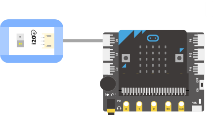

**设计意图：**当心率传感器输出高电平时，Micro:bit在LED点阵上显示图标“大爱心”；否则，Micro:bit在LED点阵上显示图标“小爱心”。将程序上传到Micro:bit后，当手指没有放在心率传感器的感应位置时，你会发现爱心闪烁的频率会很快，而当你把手指放在心率传感器的感应位置上时，你会发现爱心闪烁的频率变小了，这是因为心率传感器正在根据你的心跳周期有节奏地输出高低脉冲。

**执行流程：**

① 显示“大爱心”；若引脚P0输出高电平（即1），Micro:bit显示“大爱心”；

② 显示“小爱心”：若引脚P0输出低电平（即0），Micro:bit显示“小爱心”。

**程序示意图（中文版）：**

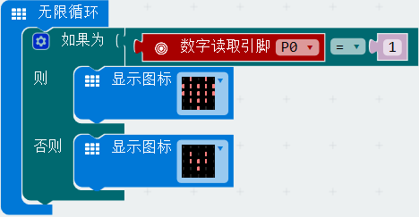

**程序示意图（英文版）：**

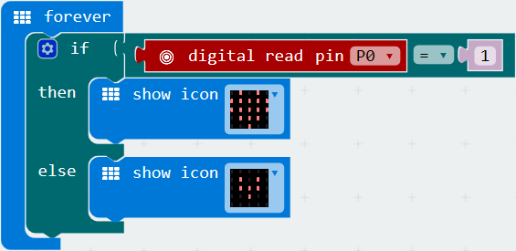

#### (2) 使用显示屏模块监测心率
**样例说明：**使用心率传感器监测人的心率变化，显示屏模块实时显示心率传感器的测量结果。

**元件清单：**心率传感器；电源主板-三路；显示屏模块。

**连线图：**

#### (3) 使用Micro:bit监测心率
**样例说明：**使用心率传感器监测心率变化，Micro:bit在LED点阵上显示心率传感器的测量结果。

**元件清单：**心率传感器；Micro:bit；Micro:bit BOSON扩展板。

**连线图：**

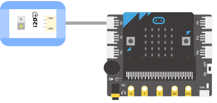

**样例程序一：通过累计一定时间的心跳次数测量心率**

**设计意图：**由于心率表示的是人每分钟心跳的次数，所以测量心率的一个思路就是使用一个变量累计一分钟内心率传感器监测到了多少次心跳。这里，设置变量“心跳次数”用来累计心跳发生的次数。每当心率传感器检测到心跳发生时，连接心率传感器的引脚P0就会被按下，此时“心跳次数”加1。理论上，让“心跳次数”这样累加1分钟即可测量出心率，但这一方法会导致Micro:bit每次都需间隔一分钟才能显示出心率测量结果。为了改善用户体验，我们将间隔时间设定为15秒，在显示心率时，由于“心跳次数”只累计了15秒，所以Micro:bit最终显示的测量结果还需要用“心跳次数”再乘以4。这样做虽然会导致每次显示的心率都是4的倍数，但这一误差相对来说是可以容忍的（如果想让测量结果更加精确，可以考虑样例程序二和样例程序三）。每次显示心率测量结果后，还需要把“心跳次数”重新置1，为下一个心率测量周期做准备。

**执行流程：**

① 累计心跳次数：每当引脚P0被按下，“心跳次数”加1；

② 显示实时心率：每隔15秒在Micro:bit的LED点阵上显示一次心率测量结果；

③ 准备下一个测量周期：“心跳次数”重新置1，为下一个心率测量周期做准备。

**程序示意图（中文版）：**

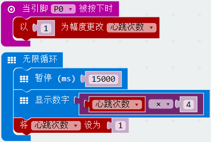

**程序示意图（英文版）：**

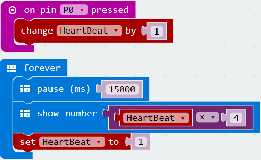

**样例程序二：通过计算最近三次心跳发生的时间间隔来测量心率**

**设计意图：**为了更加准确地测量心率，还有一个思路是先计算出两次心跳之间的时间间隔，即每次完整心跳需要花费的时间，再通过周期转换为频率即可计算出每分钟心跳的次数。例如，若算得平均间隔为800毫秒，则心跳周期为800毫秒/次，将周期进一步转为频率60000÷800=75，即心率为75次/min。最后，让Micro:bit每隔三秒在LED点阵上显示一次心率测量结果。由于单个心跳周期可能出现较大波动，这里用两个心跳周期的平均时间间隔来减小误差。于是，我们设置了三个变量“心跳时间1”、“心跳时间2”和“心跳时间3”分别用于保存最近三次心跳发生时的系统时间，求出这三次心跳发生的平均时间间隔：平均间隔=((心跳时间3-心跳时间2)+(心跳时间2-心跳时间1))/2。这样我们就算出了平均单次完整心跳需要花费的时间，只需再把心跳周期转换成频率即可计算出心率。

**执行流程：**

① 初始化变量：设置变量“心跳时间1”和“心跳时间2”用于保存最近两次心跳发生时的系统时间；

② 监测心跳：当引脚P0被按下后，用“心跳时间3”记录下当前心跳发生时的系统时间；

③ 计算平均间隔：算出三次心跳发生的平均时间间隔；

④ 显示实时心率：将平均间隔转换为心率并让Micro:bit每隔三秒显示一次心率测量结果；

⑤ 准备下一个测量周期：更新“心跳时间1”和“心跳时间2”。

**程序示意图（中文版）：**

**程序示意图（英文版）：**

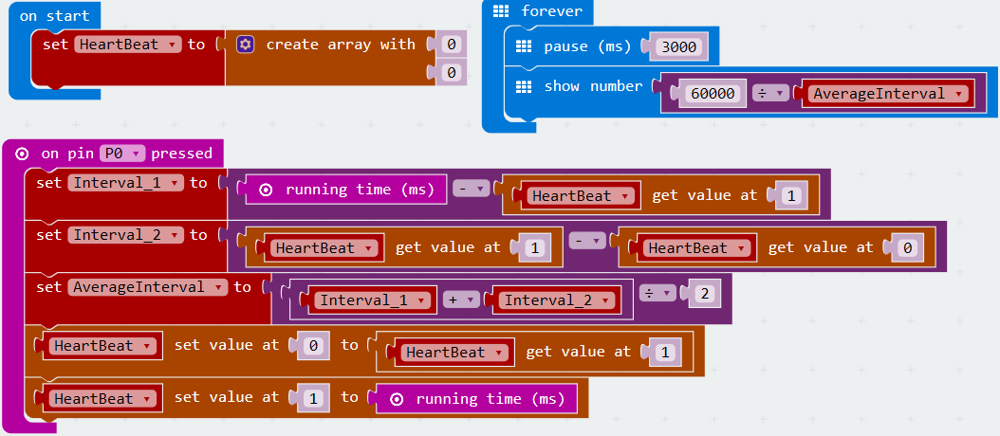

**样例程序三：通过计算最近十次心跳发生的时间间隔来测量心率**

**设计意图：**使用两个心跳周期的平均时间间隔计算心率如果还达不到理想的精确性，我们还可以使用一个数组来记录一组心跳发生时的系统时间，然后计算出这一组心跳的平均时间间隔。数组设置得越大，记录的心跳就越多，计算出的心率也就越准确，但程序的时间复杂度和空间复杂度也会随之增大。这里，我们设置了一个长度为10的数组用于保存最近十次心跳发生的系统时间，求出这十次心跳发生的平均时间间隔：平均间隔=(第十次心跳发生的时间-第一次心跳发生的时间)/9。这样我们就算出了平均单次完整心跳需要花费的时间，只需再把心跳周期转换成频率即可计算出心率。最后，让Micro:bit每隔三秒在LED点阵上显示一次心率测量结果。

**执行流程：**

① 初始化数组：设置数组“心跳时间”用于保存最近十次心跳发生时的系统时间；

② 监测心跳并更新数组：当引脚P0被按下后，数组“心跳时间”所有元素向前移一位（数组原来的首元素被覆盖），将当前这次心跳发生时的系统时间保存到数组“心跳时间”的最后一个元素中；

③ 计算平均间隔：算出数组“心跳时间”中保存的最近十次心跳发生的平均时间间隔；

④ 显示实时心率：将平均间隔转换为心率并让Micro:bit每隔三秒显示一次心率测量结果。

**程序示意图（中文版）：**

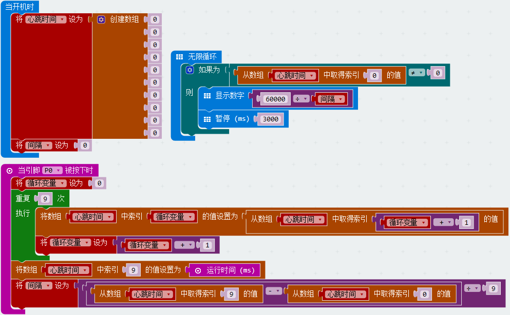

**程序示意图（英文版）：**

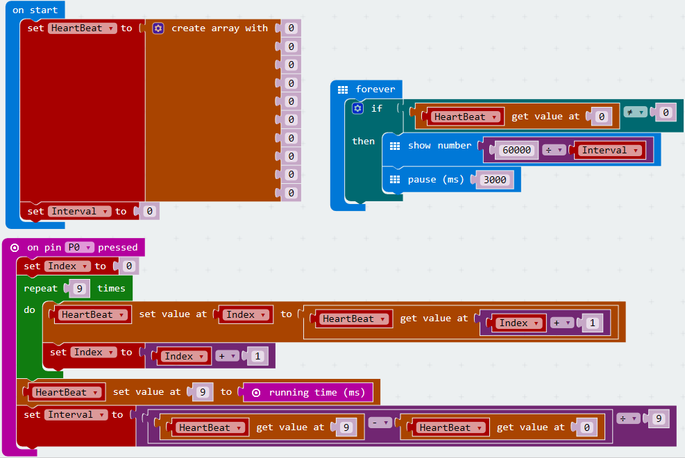

## 参数规格
引脚说明：

重量：(g)

尺寸：26mm*22mm

工作电压：3V-5V

工作电流：<10mA