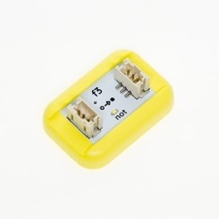
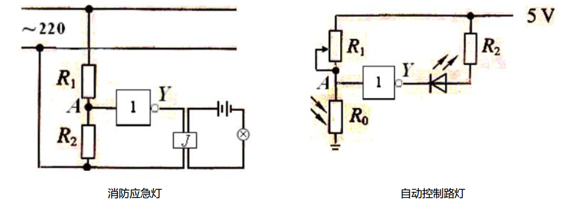
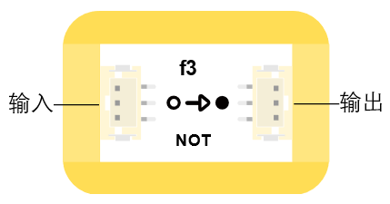
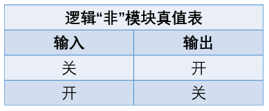

# 逻辑“非”模块
## 实物图片

## 基本信息
中文名称：逻辑“非”模块

英文名称：Logic Module - NOT

序号：f3

SKU  号：BOS0029

## 模块简介                                                                  
逻辑“非”模块是造物粒子功能模块中的一种，可以用来进行简单的逻辑运算，还可以和其他逻辑模块组合使用，实现更为复杂的功能，如数据的运算和存储。逻辑“非”模块可广泛应用于日常生活中的消防应急灯、自动控制路灯、火警报警装置等电路。

## 使用说明
逻辑“非”模块既可以放在输入端，也可以放在输出端，但该模块不能直接作为输入或输出模块使用，需要将输入模块连接在逻辑“非”模块的输入口，输出模块连接在逻辑“非”模块的输出口，通过改变输入口的信号来控制输出口。逻辑“非”模块的输入口和输出口如下图所示。

逻辑“非”模块既可以输入数字信号，也可以输入模拟信号，但该模块只能输出数字信号。逻辑“非”模块能够对输入信号进行处理并输出相应结果，其输入输出机制如下：

当输入信号为“关”或“0”时，模块输出“开”或“1”；

当输入信号为“开”或“1”时，模块输出“关”或“0”。

下图列出了逻辑“非”模块的真值表。

按照下图所示连接电路，通电后红色LED灯亮起，按下红色按钮时红色LED灯熄灭，松开红色按钮后红色LED灯再次亮起。

 
## 原理介绍 
非门是集成电路上的基本组件。简单的逻辑门可由晶体管组成，并由高低电平控制。高、低电平可以分别代表逻辑上的“真”和“假”、二进制当中的1和0、“开”和“关”，从而实现逻辑运算。

## 应用样例
####**(1) 防盗展台**

**样例说明：** 防盗展台的功能是当展品离开展台，展台自动报警。将展品放在按钮上，相当于按下按钮。当展品被拿开时，按钮弹起，蜂鸣器发出警报。正常情况下，按钮按下输出高电位，高电位会使蜂鸣器发出声音，这与之前的设想恰好相反。因此，需要借助一个逻辑“非”模块，将按钮输出的高电位转为低电位，不让蜂鸣器在按钮按下的情况下发出声音。

**元件清单：** 按钮模块；逻辑“或”模块；蜂鸣器模块；电源主板-单路。

**连线图：** 

####**(2) 智能路灯**

**样例说明：** 将模块按下图连接后可以实现如下功能：只有在晚上的时候，听到有人来了，路灯才会亮起。这一设计大大节约了电力资源。

**元件清单：** 环境光传感器；声音传感器；逻辑“非”模块；逻辑“与”模块；LED模块；电源主板-单路。

**连线图：** 

####**(3) 抢答器**

**样例说明：** 做一个抢答器，让按下按钮的人，亮起对应的灯，同时阻止另一个灯不能再亮起。

**元件清单：** 蓝色按钮模块；红色按钮模块；蓝色LED模块；红色LED模块；逻辑“与”模块；逻辑“非”模块；分支模块；电源主板-三路。

**连线图：** 

## 规格参数
引脚说明：

尺寸: 26mm*22mm

工作电压:3.0-5.5V

工作电流：(Max)32mA@5V

